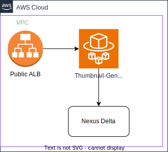

# Thumbnail Service

Generate small web friendly images of scientific artefacts

> **TODO**
> Add proper overview of the service, provide technical details, consolidate Draw.io figures, ..., etc. [See example template for further information](../template/).

## Content below copied from GitLab

### Goals:
* Serve thumbnails
* [Source](https://github.com/BlueBrain/thumbnail-generation-api)
